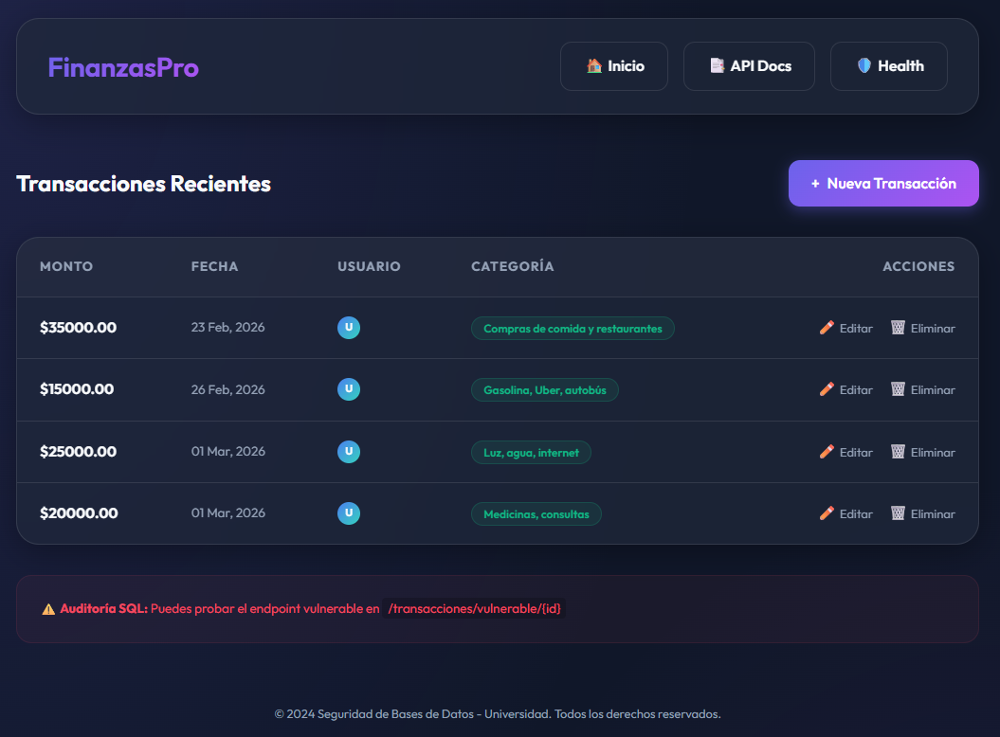

# FinanzasPro - Seguridad en Bases de Datos

Este proyecto es una aplicación web premium diseñada para la gestión de transacciones financieras, utilizada como entorno avanzado de pruebas para la seguridad en bases de datos. Combina una interfaz moderna de alta fidelidad con endpoints específicos para prácticas de seguridad ofensiva.



---

## ✨ Características Principales

### 🎨 Interfaz Premium (Nueva)
- **Glassmorphism Design:** Tarjetas y contenedores con desenfoque de fondo y bordes de cristal.
- **Dark Mode Nativo:** Optimizado para la mejor experiencia visual en entornos de desarrollo.
- **Micro-interacciones:** Animaciones fluidas al navegar y estados interactivos en botones.
- **Responsive Layout:** Diseño adaptable a cualquier tamaño de pantalla.

### 🛡️ Seguridad y Auditoría
- **Infraestructura Segura:** Despliegue automatizado en contenedores Docker.
- **Entorno Vulnerable:** Endpoints preparados intencionalmente para pruebas de **SQL Injection**.
- **Auditoría con SQLMap:** Configuración lista para ataques automatizados y análisis de vulnerabilidades.

---

## 🛠️ Tecnologías y Requisitos

### Stack Tecnológico
- **Frontend:** HTML5, Jinja2, Vanilla CSS (Custom Design System).
- **Backend:** [FastAPI](https://fastapi.tiangolo.com/) (Python 3.11).
- **Servidor:** Uvicorn con soporte de Archivos Estáticos.
- **Base de Datos:** Microsoft SQL Server 2019.
- **Infraestructura:** Docker & Docker Compose.

### Requisitos Previos
- **Docker Desktop** (Obligatorio).
- **Git** para clonación de repositorio.

---

## 🚀 Guía de Inicio Rápido

### 1. Clonar el repositorio
```powershell
git clone https://github.com/alonso523/Seguridad_Bases_de_Datos.git
cd Seguridad_Bases_de_Datos
```

### 2. Despliegue con Docker
Acceda al directorio de la aplicación y levante el entorno:

```powershell
cd Aplicacion_WEB
docker compose -f docker-compose.dev.yml up --build
```

### 3. Accesos Directos
- **Panel de Control:** [http://localhost:8000/transacciones](http://localhost:8000/transacciones)
- **Documentación Swagger:** [http://localhost:8000/docs](http://localhost:8000/docs)
- **Estado de Salud:** [http://localhost:8000/health](http://localhost:8000/health)

---

## 🔒 Pruebas de SQL Injection

Para realizar pruebas de penetración en el endpoint vulnerable:

```powershell
# Usar SQLMap dentro del contenedor de la API
docker exec -it <api_container_name> sqlmap -u "http://localhost:8000/transacciones/vulnerable/1" --batch
```

---

## 📂 Estructura del Proyecto

```text
Seguridad_Bases_de_Datos/
├── Aplicacion_WEB/
│   ├── seguridad_app/        # Lógica y Vistas
│   │   ├── static/css/      # Sistema de diseño Premium
│   │   ├── templates/       # Plantillas Jinja2 (Base + Vistas)
│   │   └── main.py          # Servidor y Configuración
│   ├── sql/                 # Scripts SQL de inicialización
│   ├── database_initializer/ # Automatización de DB
│   └── docker-compose.dev.yml
└── README.md
```

## ⚙️ Configuración por Defecto

- **Usuario SA:** `sa` / `Finanzas2024*`
- **Usuario App:** `finanzas_user` / `Finanzas2024*`
- **DB:** `FinanzasDB`
